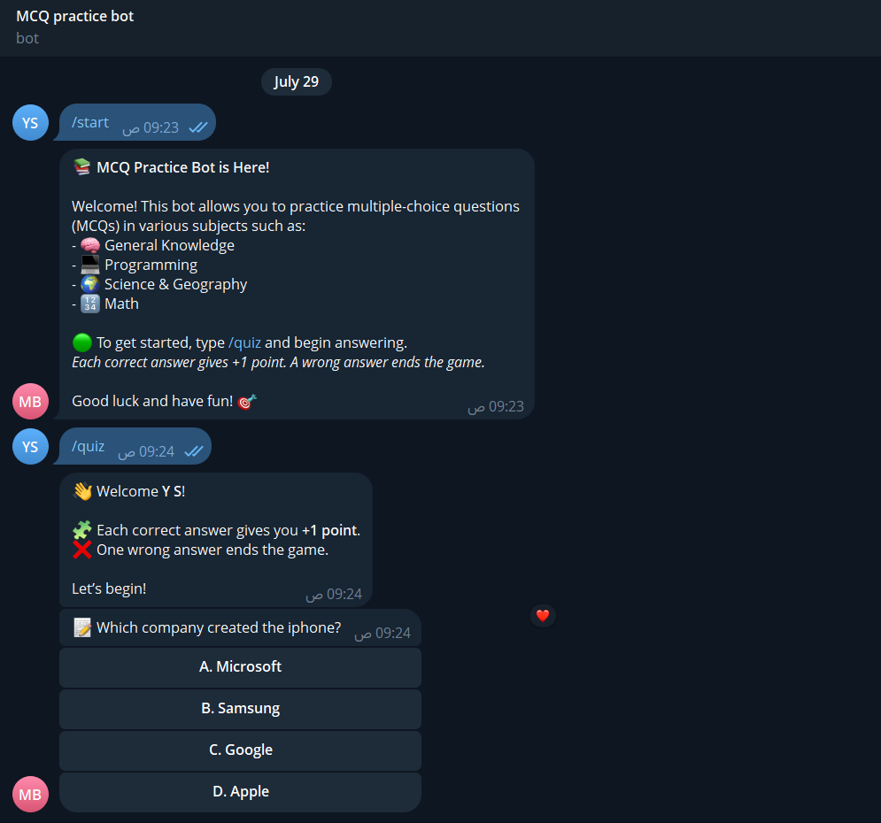

# 📚 MCQ Practice Bot

A Telegram bot built with Python that allows users to practice multiple-choice questions (MCQs) in a fun and interactive way. Users are awarded 1 point for each correct answer, and the quiz ends when a wrong answer is selected.

---

## 🚀 Features

* Randomly selects MCQs from a question bank.
* Interactive quiz experience using inline buttons.
* +1 point per correct answer.
* Ends quiz session on the first wrong answer.
* Stores and tracks user state temporarily using an in-memory cache.

---

[Watch the demo video](demo/v1.mp4)



---

## 🛠️ Tech Stack

* Python 🐍
* [PyTelegramBotAPI (Telebot)](https://github.com/eternnoir/pyTelegramBotAPI)
* JSON (for storing questions)

---

## 📂 Project Structure

```bash
.
├── main.py             # Main bot logic and interaction handlers
├── database.py         # Loads questions from a JSON file
├── runtime_cache.py    # Handles user state during quiz session
├── questions.json      # (You must provide) MCQ data in JSON format
├── config.py           # Contains your TELEBOT_TOKEN
```

---

## 🧠 How It Works

1. `/start`: Initializes a new user session and sends welcome message.
2. `/quiz`: Begins the quiz with a random question.
3. Inline buttons: Users select answers directly in the chat.
4. +1 point for each correct answer. Game ends on the first wrong answer.
5. Final score is shown at the end.

---

## 📋 Example `questions.json`

```json
[
  {
    "question": "What is the capital of France?",
    "answers": ["Berlin", "Paris", "Madrid", "Rome"],
    "right_answer_index": 1
  },
  {
    "question": "Which planet is known as the Red Planet?",
    "answers": ["Earth", "Saturn", "Mars", "Venus"],
    "right_answer_index": 2
  }
]
```

---

## ⚙️ Setup & Run

1. Clone the repo:

   ```bash
   git clone https://github.com/your-username/mcq-telebot.git
   cd mcq-telebot
   ```

2. Install dependencies:

   ```bash
   pip install pyTelegramBotAPI
   ```

3. Create `config.py`:

   ```python
   TELEBOT_TOKEN = 'YOUR_TELEGRAM_BOT_TOKEN'
   ```

4. Add your `questions.json` file.

5. Run the bot:

   ```bash
   python main.py
   ```

---

## 🧪 Sample Commands

* `/start` – Start a new session.
* `/quiz` – Begin the MCQ quiz.

---

## 📄 License

This project is open-source and free to use under the [MIT License](https://opensource.org/licenses/MIT).
